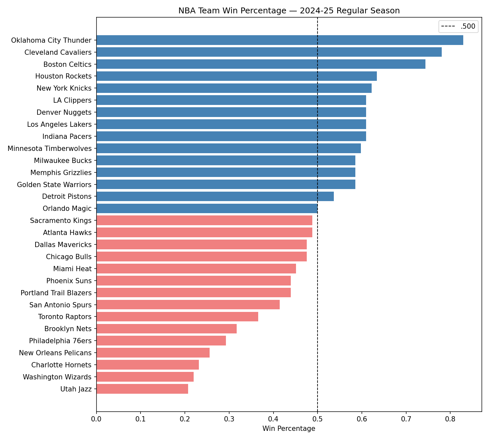
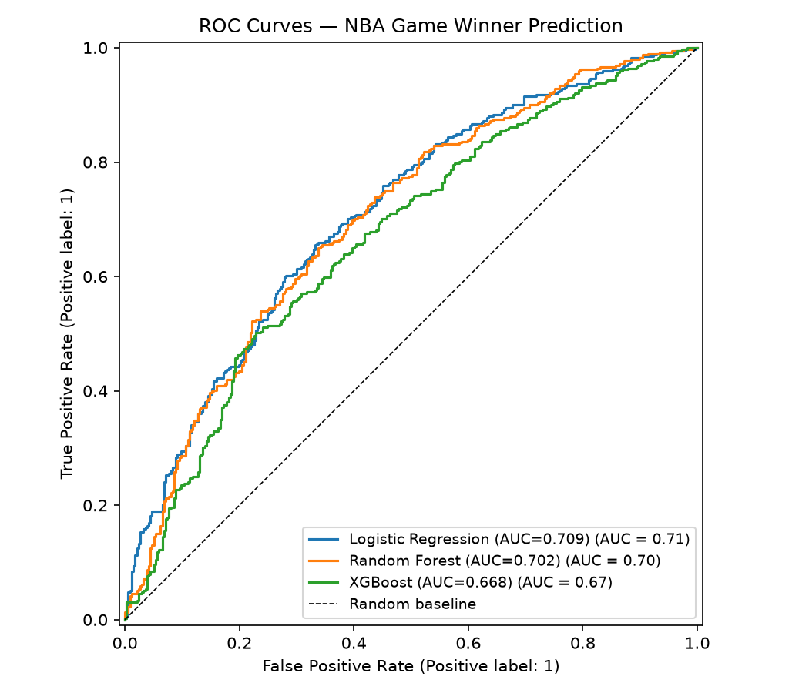
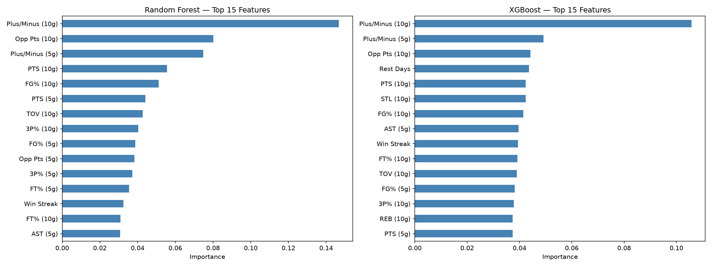
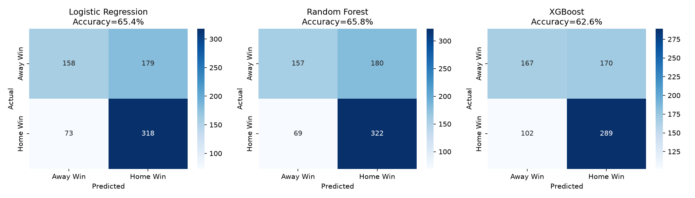
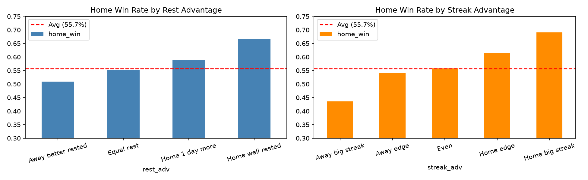

# NBA Game Outcome Predictor

Predicting NBA game winners using machine learning and recent team performance data.

3 seasons of data (2022-23, 2023-24, 2024-25) | 7,380 games | Python

---

## Results

| Model | Accuracy | ROC-AUC |
|---|---|---|
| Logistic Regression | 65.4% | 0.709 |
| **Random Forest** | **65.8%** | **0.702** |
| XGBoost | 62.6% | 0.668 |

For context, Vegas oddsmakers hover around 67-68%, making 65%+ accuracy on a clean ML pipeline genuinely competitive.

---

## Project Structure

```
nba-game-predictor/
├── notebooks/
│   ├── 01_data_collection.ipynb       # Pull and explore 3 seasons of NBA data
│   ├── 02_feature_engineering.ipynb   # Build rolling features, rest days, win streaks
│   ├── 03_modeling.ipynb              # Train and evaluate 3 ML models
│   └── 04_prediction_summary.ipynb    # Interactive game predictor
├── data/
│   └── cleaned/
│       ├── team_logs_all_seasons.csv  # 7,380 team-game rows
│       └── matchups_features.csv     # 3,638 matchup rows, 24 features
└── visuals/                           # All charts and plots
```

---

## How It Works

### 1. Data Collection
Game logs pulled from the NBA Stats API for 3 regular seasons. Each row is one team's performance in one game.

### 2. Feature Engineering
The main challenge: you can't use in-game stats to predict a game before it happens (data leakage). Instead, every feature is built from each team's recent history going into the game:

- **Rolling averages** (last 5 and 10 games) for points, rebounds, assists, steals, blocks, turnovers, FG%, 3P%, FT%, and plus/minus
- **Opponent points allowed** as a proxy for defensive strength
- **Rest days** since the last game, capped at 7
- **Win streak** going into the game
- **Differential features** computed as home minus away for every stat

Rolling windows reset at the start of each season so late-season form doesn't carry over into the next year.

### 3. Modeling
24 differential features feed into a binary classifier predicting `home_win`.

The train/test split is time-based: first 80% of games by date for training, last 20% for testing. This way the model only ever predicts games it hasn't seen.

Three models compared:
- **Logistic Regression** with StandardScaler
- **Random Forest** (300 trees, max depth 6)
- **XGBoost** (300 estimators, learning rate 0.05)

### 4. Key Findings
- Plus/minus differential is the strongest single predictor
- Home teams win 54.4% of games across the dataset
- Rest day advantage measurably shifts win probability
- Models predict home wins well (81% recall) but struggle with road upsets (47% recall)

---

## Visuals

### Team Win Percentage - 2024-25 Season


### ROC Curves


### Feature Importance


### Confusion Matrices


### Home Win Rate by Rest and Streak Advantage


---

## How to Run

```bash
git clone https://github.com/rustin-khaz/nba-game-predictor.git
cd nba-game-predictor
pip install pandas numpy matplotlib seaborn scikit-learn xgboost nba_api jupyter
jupyter notebook
```

Open the notebooks in order: 01 -> 02 -> 03 -> 04

### Predict a Game

In notebook 04:

```python
predict_game('OKC', 'CLE')
```

```
==================================================
   OKC (HOME)  vs  CLE (AWAY)
   OKC: avg 125.2 pts | streak +4
   CLE: avg 119.7 pts | streak -1
--------------------------------------------------
   Logistic Regression    OKC: 72.4%  CLE: 27.6%
   Random Forest          OKC: 74.7%  CLE: 25.3%
   XGBoost                OKC: 79.4%  CLE: 20.6%
--------------------------------------------------
   CONSENSUS: OKC wins  (75.5% confidence)
==================================================
```

---

## Tech Stack

- Python 3.12
- pandas, numpy
- nba_api
- scikit-learn
- XGBoost
- matplotlib, seaborn
- Jupyter

---

## What's Next
- Add Elo ratings as a rolling team strength metric
- Factor in player availability and injuries
- Build a Streamlit web app for live predictions
- Compare model probabilities against Vegas lines

---

*Built by [Rustin Khazravi](https://github.com/rustin-khaz)*
