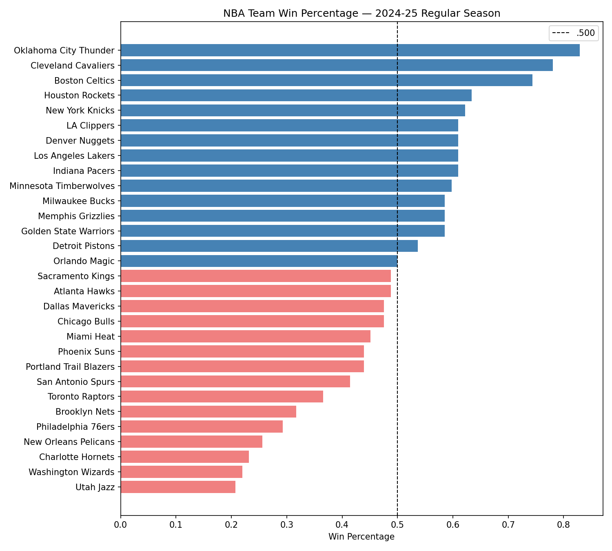
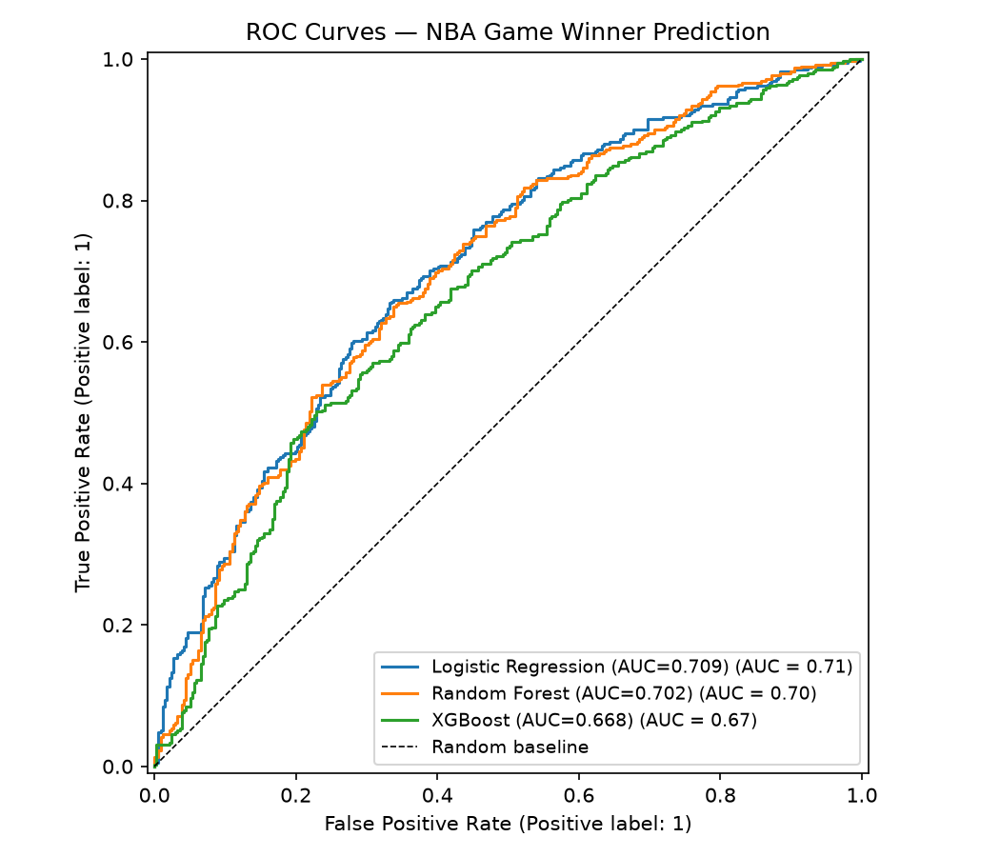
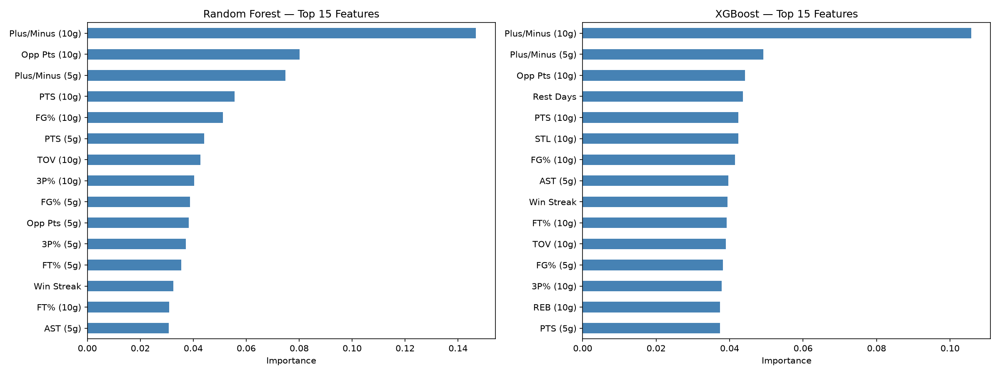
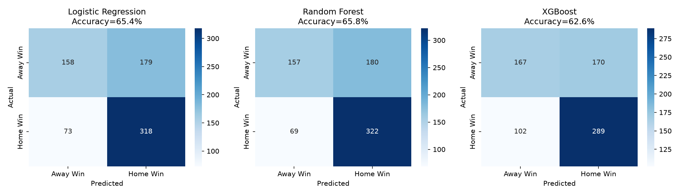
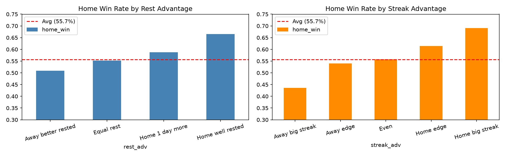

# NBA Game Outcome Predictor

I built this to predict NBA game winners from each team's recent form heading into a matchup, not season-long averages. Three seasons of data, 2022-23 through 2024-25, about 7,380 games, all in Python.

## Results

| Model | Accuracy | ROC-AUC |
|---|---|---|
| Logistic Regression | 65.4% | 0.709 |
| **Random Forest** | **65.8%** | **0.702** |
| XGBoost | 62.6% | 0.668 |

Vegas oddsmakers sit around 67-68% on these same games. Getting to 65.8% out of a pipeline built entirely from scratch feels like a real result.

## Project Structure

```
nba-game-predictor/
├── notebooks/                          # the actual analysis, meant to be run in order
│   ├── 01_data_collection.ipynb        # pulls 3 seasons of game logs from the NBA API
│   ├── 02_feature_engineering.ipynb    # turns raw logs into rolling, pre-game stats
│   ├── 03_modeling.ipynb               # trains and compares the three models
│   └── 04_prediction_summary.ipynb     # pick two teams, get a prediction
├── data/
│   └── cleaned/                        # the processed CSVs the notebooks read from
│       ├── team_logs_all_seasons.csv   # 7,380 team-game rows
│       └── matchups_features.csv       # 3,638 matchups, 24 features each
└── visuals/                            # the charts embedded further down
```

## How It Works

Game logs come from the NBA Stats API, one row per team per game, across three regular seasons.

The tricky part is avoiding data leakage: you can't use a stat from the game you're trying to predict. So every feature is built from what a team did before tipoff. That means rolling 5- and 10-game averages for points, rebounds, assists, steals, blocks, turnovers, shooting percentages, and plus/minus, plus opponent points allowed as a rough defense proxy, rest days since the last game (capped at 7), and the team's current win streak. Rolling windows reset at the start of each season so a hot April doesn't bleed into October. Every one of those becomes a differential, home stat minus away stat, 24 features in total.

The train/test split is time-based, not random. The model trains on the first 80% of games by date and gets tested on the last 20%, so it never sees a future game during training. Three classifiers get compared here: logistic regression with standard scaling, a random forest (300 trees, max depth 6), and XGBoost (300 estimators, learning rate 0.05).

A few things stood out once the models were trained. Plus/minus differential is the single strongest predictor. Home teams win 54.4% of games overall, and rest advantage shifts win probability on top of that. All three models call home wins well (81% recall) but struggle with road upsets (47% recall); box-score history alone can only tell you so much about which underdog is about to have a big night.

## Visuals

### Team Win Percentage - 2024-25 Season


### ROC Curves


### Feature Importance


### Confusion Matrices


### Home Win Rate by Rest and Streak Advantage


## How to Run

```bash
git clone https://github.com/rustin-khaz/nba-game-predictor.git
cd nba-game-predictor
pip install -r requirements.txt
jupyter notebook
```

Run the notebooks in order, 01 through 04.

In notebook 04, predict any matchup:

```python
predict_game('OKC', 'CLE')
```

```
==================================================
   OKC (HOME)  vs  CLE (AWAY)
   OKC: avg 125.2 pts | streak +4
   CLE: avg 119.7 pts | streak -1
--------------------------------------------------
   Logistic Regression    OKC: 72.4%  CLE: 27.6%
   Random Forest          OKC: 74.7%  CLE: 25.3%
   XGBoost                OKC: 79.4%  CLE: 20.6%
--------------------------------------------------
   CONSENSUS: OKC wins  (75.5% confidence)
==================================================
```

## Tech Stack

Python 3.12, pandas, numpy, nba_api, scikit-learn, XGBoost, matplotlib, seaborn, Jupyter.

## Next Steps

Next I want to add Elo ratings as a rolling strength metric and factor in player injuries and availability. Longer term, I'd like to wrap this in a small Streamlit app for live predictions and check the model's probabilities against real Vegas lines.

Built by [Rustin Khazravi](https://github.com/rustin-khaz)
